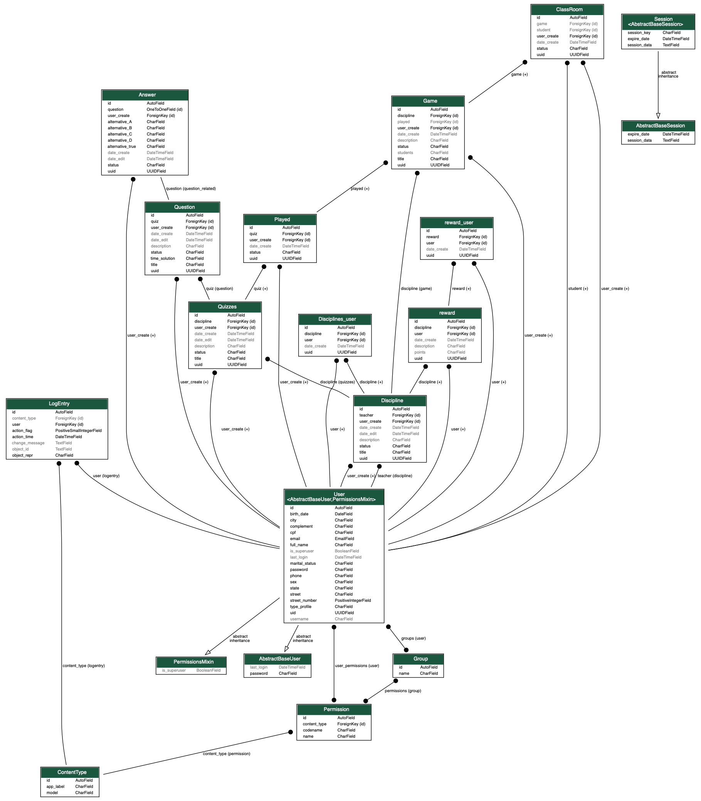

# eQuest Games

Sistema de respostas para estudantes, o qual visa atingir o potencial da gamificação para motivar e engajar os alunos durante o processo de aprendizado.

## Início - Principais características

* Plataforma multi tenancy, com perfil aluno e professor;
* Implementação de sistema em plataforma Web totalmente responsiva;
* Persistência de dados no banco mysql, utilizando modelo relacional;
* Jornada do Usuário e Casos de Uso.

### Pre-requisitos

Requisitos minimos para utilização do sistema:

```
Python 3.7.2+
```
```
Django 2.0.2+
```

### Instalação

A seguir um passo a passo para a instalação do sistema e suas dependências

* clone o projeto:
```
git clone https://github.com/diegocostacmp/e-quest.git
```
* Certifique-se de que o Python e o Ambiente Virtual (venv) estejam instalados.
Crie o ambiente virtual e instale os pacotes.
 ```
 cd e-quest
 virtualenv venv
 source venv/bin/activate
 pip install -r requirements.txt
```
* Execute as migrações do banco de dados:

```
python manage.py makemigrations
python manage.py migrate
```

## Diagrama de classes


## Construido com

* [Python](https://www.python.org/) - Linguagem de programacao
* [Django](https://www.djangoproject.com/) - Framework python


## Autores

* **Diego B B Costa** - *Trabalho inicial* - [PurpleBooth](https://github.com/diegocostacmp)
* **Ricardo Oliveira** - *Trabalho inicial* - [PurpleBooth](https://github.com/ricardoflayer)

## Licenca

This project is licensed under the MIT License.

## Agradecimentos 

* Agradecemos ao INF (Instituto de informatica) pelo apoio e conhecimento.


